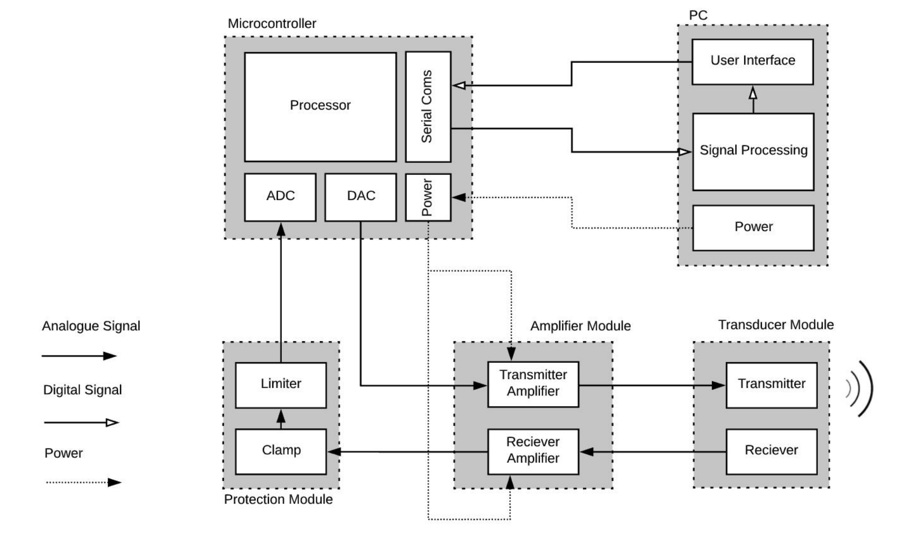
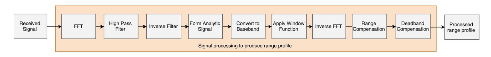
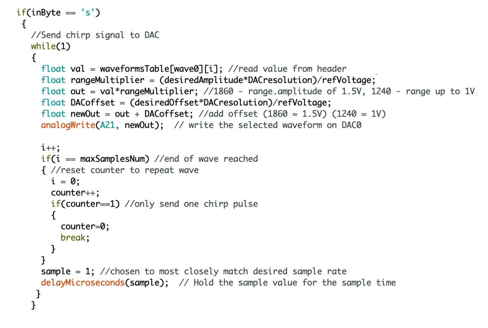

# BatScan - Sonar Imaging

The BatScan project involved the design, implementation, and testing of an indoor sonar imaging system operating at 40kHz. 
The project involved signal processing in Julia to obtain a 1D range profile and 2D direction of arrival estimation as well as embedded software for a Teensy 3.6 microcontroller.

## Block Diagram

## Signal Processing

## Embedded Software

