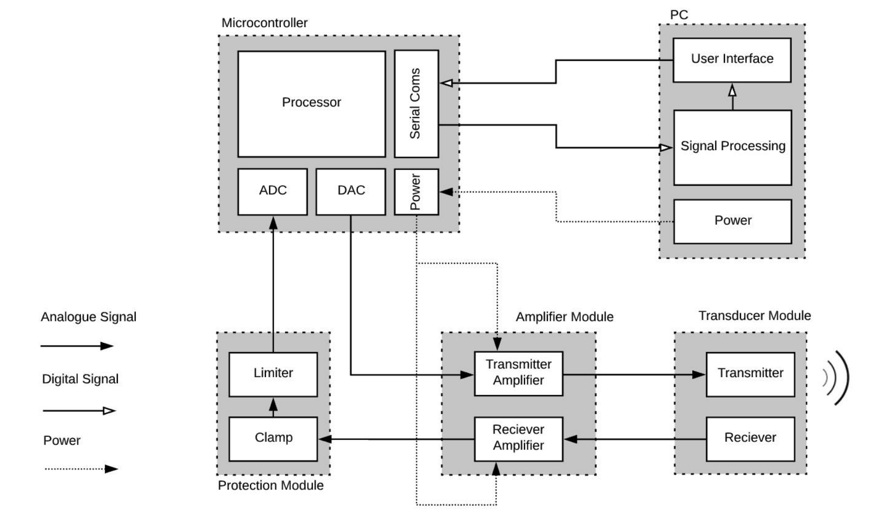
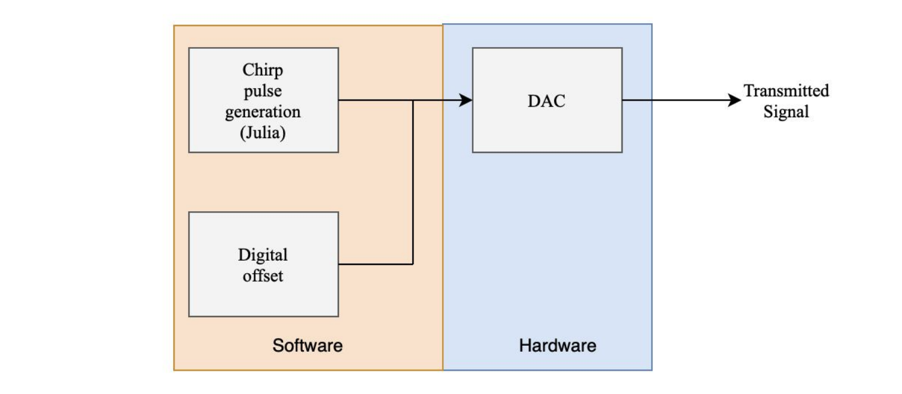
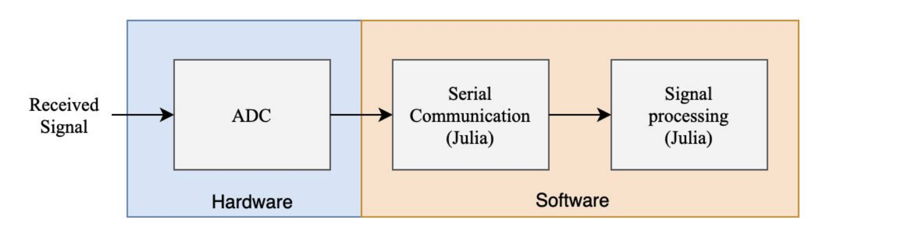
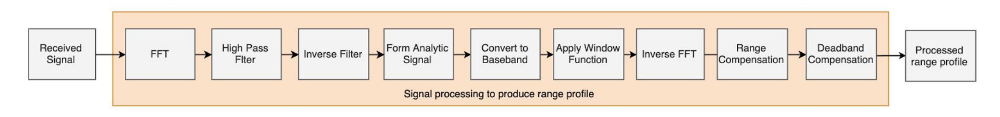
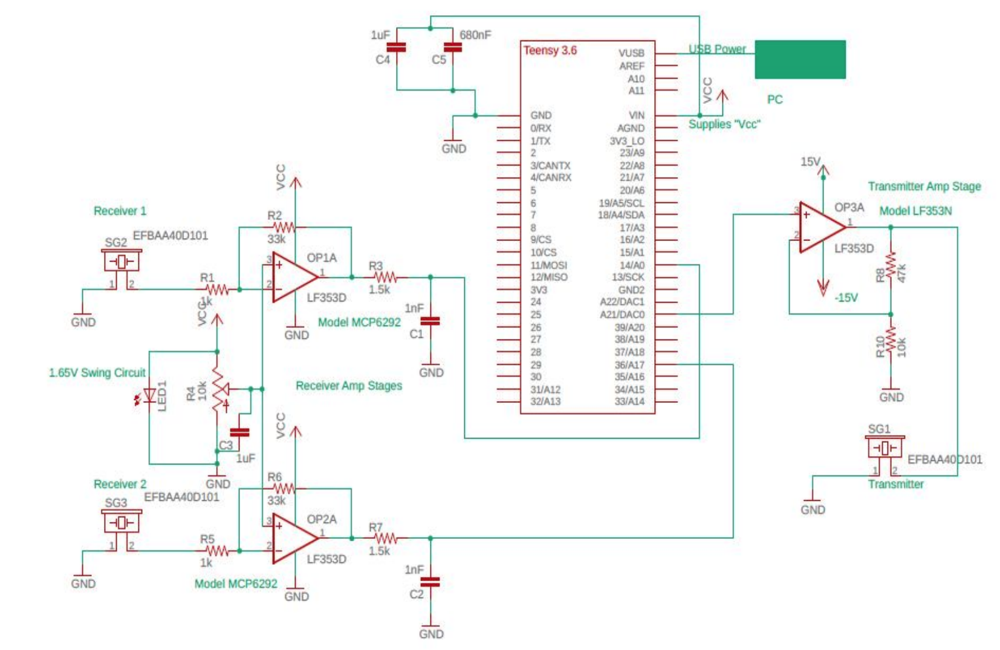
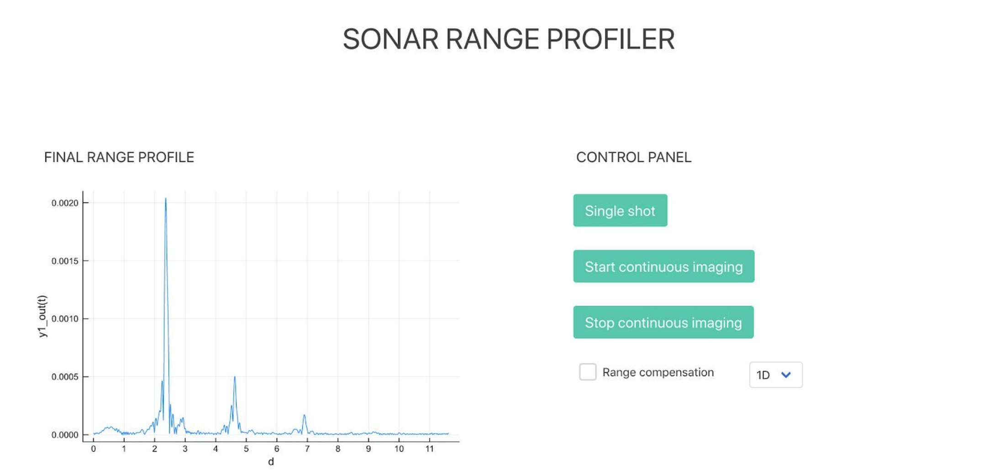

# BatScan - Sonar Imaging

The BatScan project involved the design, implementation, and testing of an indoor sonar imaging system operating at 40kHz. 
The project involved signal processing in Julia to obtain a 1D range profile and 2D direction of arrival estimation as well as embedded software for a Teensy 3.6 microcontroller.

## Block Diagram
The block diagram below depicts the major components of the sonar imaging system and their interconnections.

The main functioning of each module in the sonar imaging system is as follows:
- The **microcontroller** generates the transmit pulse using a DAC and samples the returned
signal using the ADC. The sampled receive signal is then sent to the **PC** for signal processing. 
- The **protection module** exists to limit any voltage or current that is placed on an input to the microcontroller. 
- The **amplification module** amplifies the signal at the output of the DAC to drive the transmitter. The received
signal is also amplified before it is sampled by the ADC. 
- The **transducer module** contains the transmitter and receiver. The transmitter converts a voltage into an ultrasonic wave that propagates through the scene.
This wave will be reflected by any present targets. This echo is detected by the receiver which converts it back into a voltage for processing.

## Embedded Software
Embedded software for the Teensy 3.6 microcontroller was required for both the transmission of the chirp signal from the DAC and the sampling of the received echo using the ADC.

### Transmitter
The chirp pulse was generated using values from a header file. It should be noted that the chirp pulse parameters can be modified as a new header file can be generated based on the parameters entered into the _makeWave.jl_ program. This allows a custom chirp pulse to be output by the DAC.

### Receiver
In order to read in the received signal from the receiver transducer, the 16-bit ADC on the Teensy board will be used to convert the analogue input to a digital representation which can then be processed, as shown below.

In order to write the received signal values to an array, a Julia script was written to directly read in the values from the serial port and write them to an output array for use in the signal processing algorithm

## Signal Processing
The received signal that is sampled by the microcontroller must undergo signal processing to produce the final image. The core components of the signal processing algorithm are encapsulated in the following diagram.

## Circuit Diagram
The complete circuit diagram is included below.

## User Interface
To display the sonar imaging results, a web application was built using _Interact.jl_ and _Mux.jl_.

